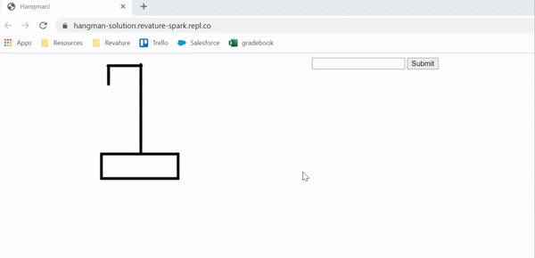

# Instructions  
If you are unfamiliar with the rules of Hangman, the game works like this:
- A gallows is drawn on a surface, and Player 1 chooses a word that player 2 must guess.
- Empty dashes for each letter in the word are drawn next to the gallows (so a 7-letter word means 7 dashes).
- Each round, player 2 guesses a letter that might belong in the word.
- If the word contains one or more instances of the guessed letter, the dashes corresponding to the guessed letter are replaced with the guessed letter.
- If the word contains no instances of the guessed letter, a limb of a person is drawn on the gallows. This is a "strike", and the letter is recorded as such.
- When a complete stick-figure person is drawn on the gallows, player 2 loses and player 1 wins. If the word is guessed completely before that happens, player 2 wins.
- When a complete stick-figure person is drawn on the gallows, player 2 loses and player 1 wins. If the word is guessed completely before that happens, player 2 wins.

Here's an example of what your game might look like:
<br><br>

It is highly recommended that you add CSS to make it pretty!

## Steps
  1. The HTML page should be divided into four sections:
  - A gallows section that will display a picture of the gallows and hanged man in stages.
  - A strikes section that will display incorrect guesses.
  - A word section that will show the word to guess as it is slowly revealed.
  - A guess section that will contain a form where the player can type in their guess each round.
  <br><br>
  Create the HTML elements you'll need and give them id attributes that will make them easier to select with CSS and JavaScript later - this game will be driven by event management and DOM manipulation. Note that there are 7 images in the **images** folder that you can use for the gallows section, corresponding to the number of strikes accrued.
  <br><br>
  2. The logic for this game will be fairly complex compared to everything you've done so far, but all of it should be familiar. The first thing you'll need to do in your JavaScript is create some variables that will track the game's state (and we can grab the word to guess at the same time!). Add the following code to your **script.js** file: 
  ```JavaScript
  let word = prompt("Welcome to Hangman! Player 1, please enter a word for Player 2 to guess.").toUpperCase();

  let revealedLetters = new Array(word.length);
  revealedLetters.fill(false);

  const maxStrikes = 6; 
  let strikes = 0;
  let strikeLetters = new Array(maxStrikes);
  ```
  Let's break down what all of this code is meant to do. The first statement prompts the first player to enter a word for the second player to guess. The input is saved as all uppercase letters into the variable named **word**. Note the switch **toUpperCase()**: we want to always work in upper case letters to avoid confusing 'a' and 'A' as unequal.
  <br><br>
  The next statement creates an array with as many elements as word has characters. Each index of revealedLetters will correspond to a character in word, and if revealedLetters[n] is truthy, then word[n] has been correctly guessed. The next statement starts every element in the array as `false`, meaning no letters have been correctly guessed yet.
  <br><br>
  The **maxStrikes** variable holds how many strikes the second player can get without the game ending. The next variable, **strikes**, holds the current strikes the second player has, which starts at `0`. The last statement creates an array that will contain every letter that has been incorrectly guessed by the second player. We can use this array to display the letters to the user so they can see which incorrect letters they've already guessed.
  <br><br>
  3. You'll need the following four functions. Note that we have included helpful comments describing what each function should do. Add them to your script file:
  ```JavaScript
  
  function drawStrikeLetters() {
    // should create a String from strikeLetters and put that into the content of some element
  }

  function drawWordProgress() {
   // should iterate over revealedLetters, and if the value at each index is truthy, print the corresponding letter from word. Otherwise, it should print a -
  }

  function drawGallows() {
    // should update an  element's src attribute to point to "images/strike-" + strikes + ".png"
  }

  function processGuess(e) {
    e.preventDefault(); // prevent the form from trying to send information somewhere

    let guess; // assign to the value of the <form>'s <input> element, toUpperCase()

    if (strikes < maxStrikes) {
      // IF word.includes(guess)
        // loop over word
          // if current letter matches guess, set corresponding index in revealedLetters to a truthy value
      // ELSE 
        // update strikeLetters at current strike with incorrect guess
        // increment strikes
        // invoke drawGallows() and drawStrikeLetters()

      // invoke drawWordProgress() to update HTML
      // check if player 2 has won by looping over revealedLetters. if no values are false, player 2 wins
    } else {
      alert("The game is over!");
    }
  }

  // add event listener
  // make an inital call to drawWordProgress()
  ```
  The **drawStrikeLetters()** function will be called by the **processGuess()** function to manipulate the DOM to write all the strike letters to the respective section in your HTML file.
  <br><br>
  The **drawWordProgress()** function will be called by the **processGuess()** function to manipulate the DOM to write the successfully guessed letters of the word, replacing them with dashes if not yet guessed.
  <br><br>
  The **drawGallows()** function will be called by the **processGuess()** function to manipulate the DOM to update the image of the gallows depending on the current strike.
  <br><br>
  The **processGuess()** function should be invoked whenever the second player makes a guess (submits the form). This function is where your program will make the majority of its decisions. We have helpful pseudocode outlining possible steps for you to take.
  <br><br>
  Lastly, take note of the last two comments. You would need to add an event listener to either the HTML form or the form's button so that when the form is submitted or the button is clicked, the **processGuess()** function is invoked. The second comment recommends calling **drawWordProgress()** once so that the HTML section representing the revealed word will start with all dashed letters.
  <br><br>

## Requirements
Once you are done with your project, check it against the requirements below to make sure you have included everything:
* gallows HTML section that displays images
* strikes HTML section that displays incorrect guesses
* word HTML section that shows word to guess and is slowly revealed
* guess HTML section that contains a form where the player can type in
* have variables listed in the instructions
* contains the 3 functions specified in the instructions to update 
 respective HTML sections
* contains the **processGuess()** function to check guess, use 3 update functions, 
 and to check if anyone wins
* use prompts and alerts

## Final Notes
These instructions are obviously not comprehensive, and you will of course have to fill in the gaps on your own. One of the things that makes programming fun and addictive is that you can always make improvements somewhere! 

Because this project is more complex, we highly recommend that you read over the instructions several times until you have a clearer idea of the steps you'd like to take ask your peers for help if you get stuck.


  